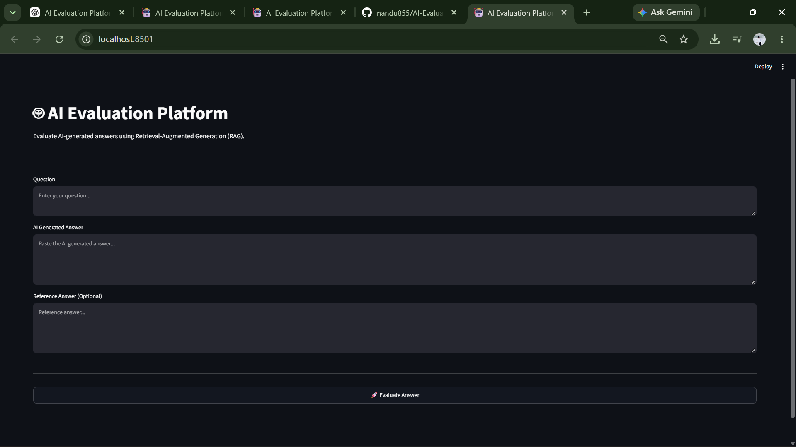
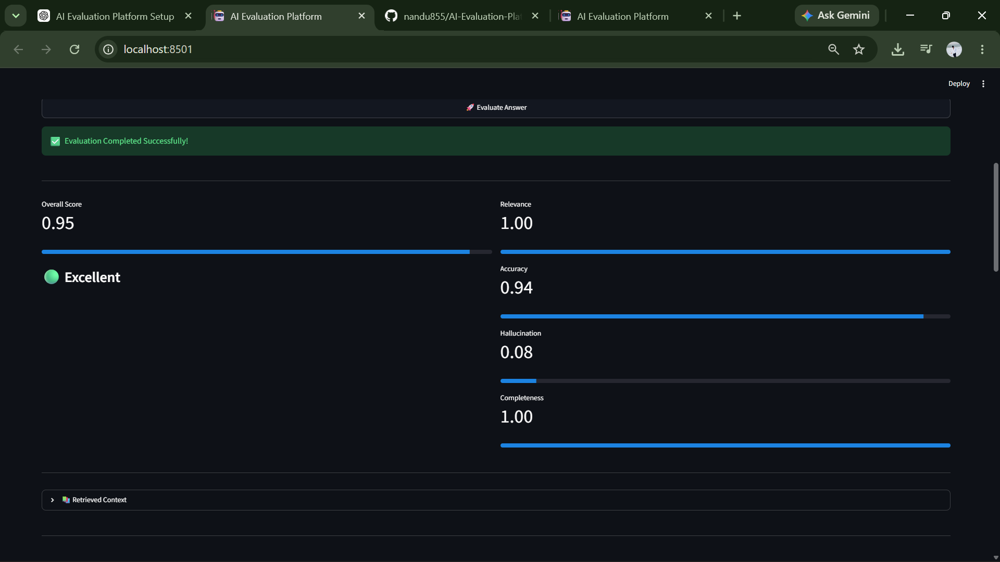
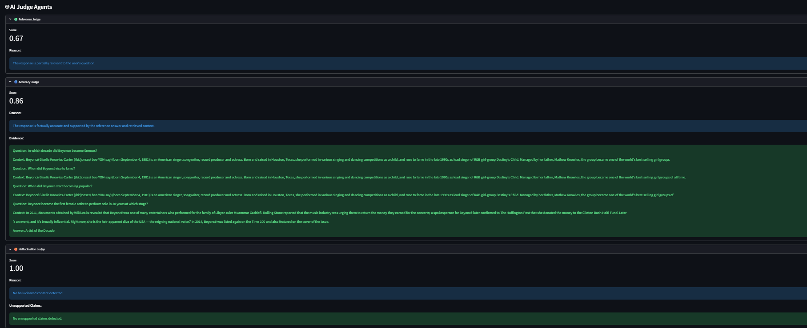
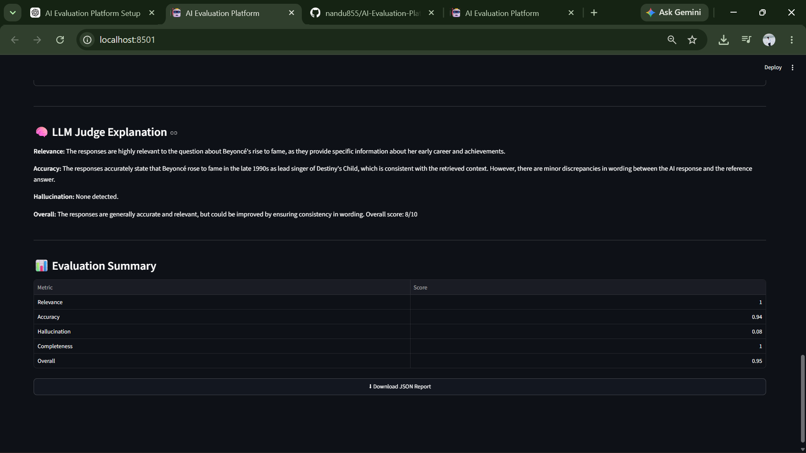
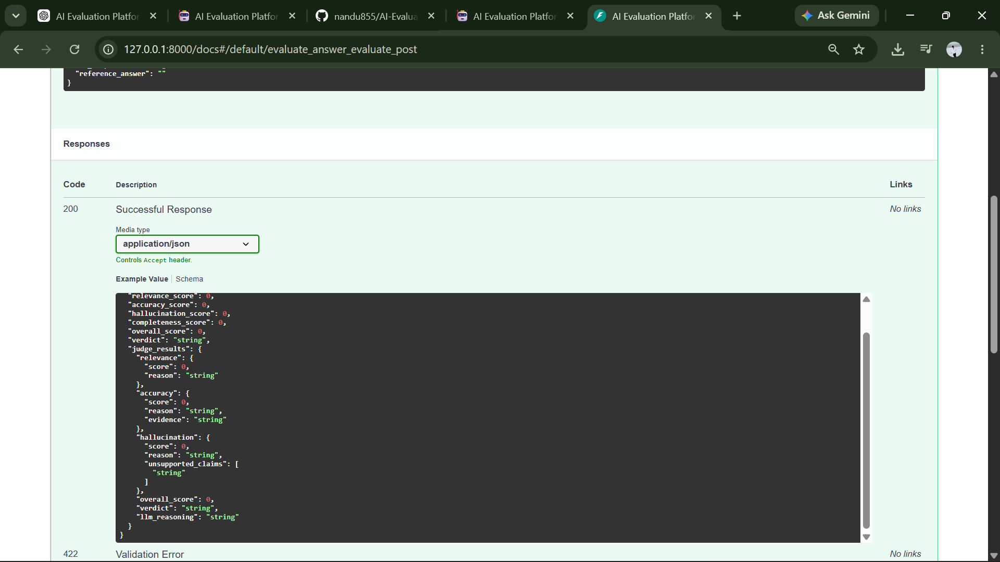

# 🤖 AI Evaluation Platform

An AI-powered evaluation platform that assesses AI-generated responses using **Retrieval-Augmented Generation (RAG)**, **semantic similarity**, **AI Judge Agents**, and **LLM-based reasoning (Llama 3.2 via Ollama)**.

The platform retrieves relevant context from a vector database, evaluates AI responses across multiple quality metrics, detects hallucinations, and generates human-readable reasoning through an LLM.

---

## 🚀 Features

- ✅ Retrieval-Augmented Generation (RAG)
- ✅ ChromaDB Vector Database
- ✅ Sentence Transformer Embeddings
- ✅ FastAPI REST API
- ✅ Streamlit Interactive Dashboard
- ✅ AI Judge Agents
  - Relevance Judge
  - Accuracy Judge
  - Hallucination Detection Judge
- ✅ Local LLM Integration using Ollama (Llama 3.2)
- ✅ Automatic Evaluation Report Generation
- ✅ JSON Report Download
- ✅ Validation on Benchmark Question-Answer Pairs

---

# 🏗️ System Architecture

```
                User
                  │
                  ▼
          Streamlit Frontend
                  │
                  ▼
            FastAPI Backend
                  │
      ┌───────────┴────────────┐
      ▼                        ▼
 RAG Retrieval            Evaluation Engine
      │                        │
      ▼                        ▼
  ChromaDB               Judge Manager
                               │
        ┌──────────────┬──────────────┬──────────────┐
        ▼              ▼              ▼
 Relevance Judge  Accuracy Judge  Hallucination Judge
        │              │              │
        └──────────────┴──────────────┘
                       │
                       ▼
             LLM Judge (Llama 3.2)
                       │
                       ▼
              Final Evaluation Report
```

---

# 🛠️ Tech Stack

| Category | Technologies |
|-----------|--------------|
| Language | Python |
| Backend | FastAPI |
| Frontend | Streamlit |
| Embeddings | Sentence Transformers |
| Vector Database | ChromaDB |
| Retrieval | RAG |
| LLM | Ollama (Llama 3.2) |
| Dataset | SQuAD, TruthfulQA |
| Report Generation | ReportLab |
| API Testing | Swagger UI |

---

# 📂 Project Structure

```
AI-Evaluation-Platform
│
├── backend
│   ├── agents
│   │   ├── relevance_agent.py
│   │   ├── accuracy_agent.py
│   │   ├── hallucination_agent.py
│   │   ├── llm_judge.py
│   │   ├── judge.py
│   │   └── __init__.py
│   │
│   ├── chroma_db
│   ├── datasets
│   ├── main.py
│   ├── models.py
│   ├── rag.py
│   ├── report.py
│   ├── scorer.py
│   └── __init__.py
│
├── frontend
│   └── app.py
│
├── scripts
│   ├── validate_agents.py
│   └── __init__.py
│
├── requirements.txt
└── README.md
```

---

# ⚙️ Installation

Clone the repository

```bash
git clone https://github.com/nandu855/AI-Evaluation-Platform.git

cd AI-Evaluation-Platform
```

Create a virtual environment

```bash
python -m venv venv
```

Activate virtual environment

Windows

```bash
venv\Scripts\activate
```

Install dependencies

```bash
pip install -r requirements.txt
```

---

# 🦙 Install Ollama

Download Ollama

https://ollama.com/download

Download Llama 3.2

```bash
ollama pull llama3.2
```

Verify installation

```bash
ollama run llama3.2
```

---

# ▶️ Run the Backend

```bash
uvicorn backend.main:app --reload
```

Backend URL

```
http://127.0.0.1:8000
```

Swagger Documentation

```
http://127.0.0.1:8000/docs
```

---

# ▶️ Run the Frontend

```bash
streamlit run frontend/app.py
```

Frontend URL

```
http://localhost:8501
```

---

# 📊 Evaluation Metrics

The platform evaluates responses using:

- Relevance Score
- Accuracy Score
- Hallucination Score
- Completeness Score
- Overall Score

---

# 🤖 AI Judge Agents

## Relevance Judge

Measures whether the response answers the user's question.

---

## Accuracy Judge

Measures factual consistency using:

- Reference Answer
- Retrieved Context

---

## Hallucination Judge

Detects unsupported or fabricated information.

---

## LLM Judge

Uses **Llama 3.2 (Ollama)** to provide natural-language reasoning for the evaluation.

---

# 📸 Screenshots

## Home Page



---

## Evaluation Results



---

## AI Judge Agents



---

## LLM Judge



---

## Swagger API



---

# 🔬 Benchmark Validation

The AI Judge Agents were validated using multiple benchmark question-answer pairs to verify:

- Consistent scoring
- Reasoning quality
- Hallucination detection
- Accuracy assessment

---

# 🚀 Future Enhancements

- LLM-generated reasoning for each judge agent
- Natural Language Inference (NLI) based hallucination detection
- Automated benchmark evaluation reports
- Additional benchmark datasets
- Docker support
- CI/CD pipeline
- Cloud deployment

---

# 👨‍💻 Author

**Anand kumar badarala**

GitHub:

https://github.com/nandu855

---

# ⭐ If you found this project useful

Please consider giving it a ⭐ on GitHub.